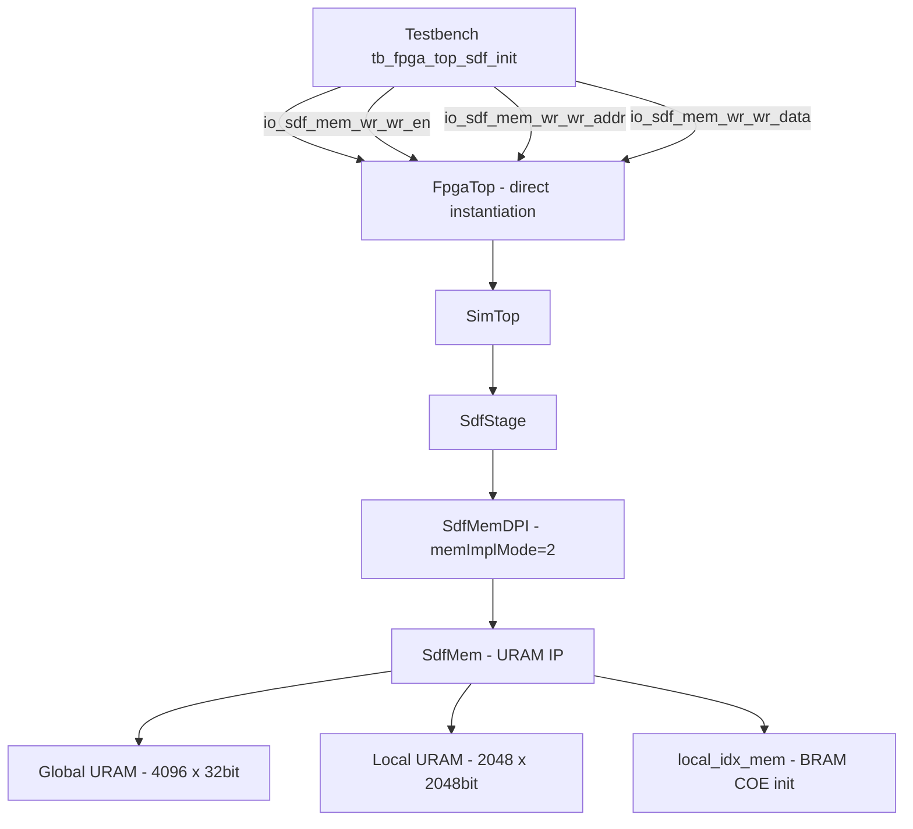
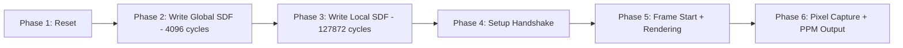

# SDF URAM Initialization Testbench Plan

## Problem Statement

The SDF memory in FpgaTop uses URAM (via `xpm_memory_spram` with `MEMORY_PRIMITIVE = "ultra"`), which cannot be initialized via COE files like BRAM. Other memories (triangle, normal, BVH, subgrid_meta, local_mapping) are already COE-initialized in Vivado. The SDF data must be written through the top-level `io_sdf_mem_wr` interface before rendering begins.

## Architecture Overview

## Key Interface Details

### FpgaTop SDF Write Port (from [`FpgaTop.sv`](build/vivado/FpgaTop.sv:19282))

| Signal | Width | Direction | Description |
|--------|-------|-----------|-------------|
| `io_sdf_mem_wr_wr_en` | 1 | input | Write enable |
| `io_sdf_mem_wr_wr_addr` | 32 | input | Full address - auto-decoded |
| `io_sdf_mem_wr_wr_data` | 32 | input | Single FP32 value |

### SdfMem Address Encoding (from [`SdfMem.sv`](src/main/resources/SdfMem.sv:73))

| Region | Condition | Address Fields | Range |
|--------|-----------|---------------|-------|
| Global SDF | `addr[31:12] == 0` | `addr[11:0]` = entry index | 0..4095 |
| Local SDF | `addr[31:12] != 0` | `addr[18:8]` = cell_idx, `addr[7:2]` = lane | cell 0..2047, lane 0..63 |

**Convenient local address formula**: `addr = 0x80000000 | cell_idx << 8 | lane << 2`

### Memory Data Sizes

| Memory | Entries | Source File | Format |
|--------|---------|-------------|--------|
| Global SDF | 4096 | `sdf_global_mem.mem` | Sequential hex, 1 value/line |
| Local SDF | 127,872 | `sdf_local_mem.mem` | Sequential hex, 1 value/line |
| Local mapping | 4096 | `sdf_local_mapping.coe` | Already COE-initialized in BRAM |

## Testbench Design

### Why Instantiate FpgaTop Directly

The existing [`fpga_top.v`](build/vivado/fpga_top.v:18) wrapper only exposes `io_sdf_mem_wr_en` as a top-level port. The `cfg_sdf_wr_addr` and `cfg_sdf_wr_data` are internal `DONT_TOUCH` registers not accessible from outside. For the testbench, we instantiate `FpgaTop` directly to get full access to all three write signals.

### Simulation Phases

### Phase Details

**Phase 1 — Reset** (20 cycles)
- Hold `reset = 1`, all other signals = 0
- Release reset, wait 5 cycles

**Phase 2 — Global SDF Write** (~4096 cycles)
- Load `sdf_global_mem.mem` into `reg [31:0] sdf_global [0:4095]` via `$readmemh`
- For each index `i` in 0..4095:
  - `wr_en = 1`, `wr_addr = i` (upper 20 bits = 0), `wr_data = sdf_global[i]`
  - Wait 1 clock cycle
- After last write: `wr_en = 0`, wait a few drain cycles

**Phase 3 — Local SDF Write** (~127,872 cycles)
- Load `sdf_local_mem.mem` into `reg [31:0] sdf_local [0:131071]` via `$readmemh`
- Linear index `lin = cell_idx * 64 + lane`
- For each `cell_idx` in 0..1997, `lane` in 0..63:
  - `wr_en = 1`, `wr_addr = 0x80000000 | cell_idx << 8 | lane << 2`
  - `wr_data = sdf_local[cell_idx * 64 + lane]`
  - Wait 1 clock cycle
- After last write: `wr_en = 0`, wait drain cycles

**Phase 4 — Setup Handshake**
- Drive `io_setup_valid = 1` for 1 cycle with origin/grid parameters
- Wait for `io_setup_ready` / `io_setup_finish`

**Phase 5 — Frame Start + Rendering**
- Pulse `io_frame_start = 1` for 1 cycle
- Wait for `io_frame_done`

**Phase 6 — Pixel Capture + PPM Output**
- Capture pixels during rendering into RGB buffer
- On `io_frame_done`, write PPM file
- Add timeout safety net

### Read-back Verification Task

Optional `verify_sdf_write` task that:
1. Drives SdfMem read interface via internal probes or separate SdfMem instance
2. Compares read data against expected mem file values
3. Reports mismatches

> Note: Full read-back requires accessing SdfMem internals which are not exposed at FpgaTop level. A simpler verification is to compare the final rendered image against the Verilator simulation reference output.

## fpga_top.v Wrapper Update

The current [`fpga_top.v`](build/vivado/fpga_top.v:18) needs to expose `io_sdf_mem_wr_wr_addr` and `io_sdf_mem_wr_wr_data` as top-level ports for PS-driven initialization on the actual FPGA. The updated wrapper should:

1. Add `input [31:0] io_sdf_mem_wr_addr` and `input [31:0] io_sdf_mem_wr_data` to the port list
2. Replace the internal `cfg_sdf_wr_addr`/`cfg_sdf_wr_data` registers with direct connections to these new top-level ports
3. Keep `io_sdf_mem_wr_en` as existing top-level port

This enables the PS to drive all three SDF write signals during the initialization phase before rendering starts.

## Files to Create/Modify

| File | Action | Description |
|------|--------|-------------|
| `build/vivado/tb_fpga_top_sdf_init.v` | **Create** | New testbench with SDF init + rendering |
| `build/vivado/fpga_top.v` | **Modify** | Expose sdf_wr_addr/wr_data as top-level ports |

## Estimated Simulation Time

- Global SDF write: ~4,096 cycles ≈ 41 µs @ 10ns period
- Local SDF write: ~127,872 cycles ≈ 1.28 ms @ 10ns period
- Total init overhead: ~1.32 ms (negligible compared to rendering time)